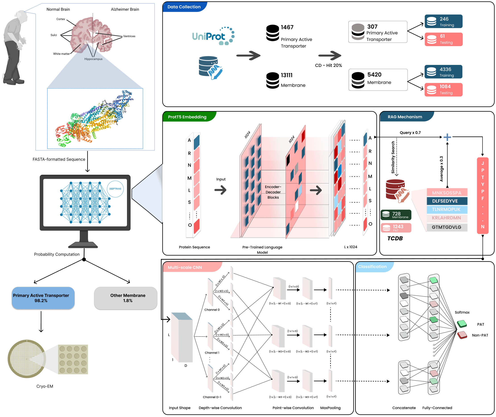

# DEEPTRANS: Accurate Classification of Primary Active Transport Proteins Using RAG-Enhanced PLMs and MSCNN



---

## 🧠 Overview

**DEEPTRANS** is a deep learning framework that combines pre-trained protein language models (PLMs) with a multi-scale convolutional neural network (MSCNN) to accurately classify **primary active transport proteins** from other membrane proteins.

---

## 🚀 Getting Started

### 🔧 Environment Setup

Before running the code, make sure to install all required Python packages:

```bash
pip install -r requirements.txt
```
## 🧪 Running the Model

🔹 Step 1: Generate Embeddings
To extract ProtT5 embeddings for your FASTA files:
```bash
python get_ProtTrans.py --input your/fasta/input/folder --output your/protT5/embedding/folder
```
🔹 Step 2: Train the model
If you want to train the DEEPTRANS model from scratch:
```bash
python MSCNN.py -maxseq 1000 -f 256 -hi 500 -w 2 4 6 8 10 -nf 1024 -df "prottrans" -imb "None" -vm ind -csv "5CV.csv"
```
🔹 Step 3: Evaluate on Independent Test Set
To evaluate DEEEPTRANS on unseen data:
```bash
python run.py -x ABC_data.npy -w ../Model_MSCNN_RAG_class1_1000_prottrans_2_4_6_8_10.h5 -o ABC
```


## 🧬 Contact

For questions or feedback, please contact:
Le Van The – therystudy1993@gmail.com

## Web-server

(Ongoing)
